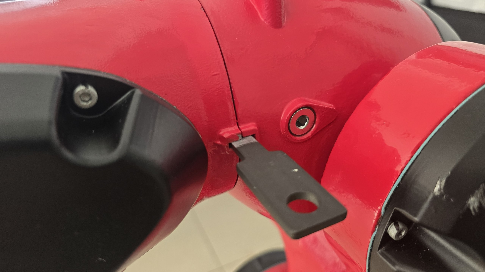

# Home calibration — the groove/blade mechanical zero

The **authoritative zero** of the BRTIRUS0707A is mechanical, set by **alignment
grooves** machined into each joint. This is the ground truth the whole ROS
calibration depends on: with every joint seated at its groove, the controller
reads `axis-N ≈ 0` and the URDF model sits at `q = 0`. **Never** establish home
by eye — an eyeballed pose can be tens of degrees off on J2/J3/J5 and will send a
sign/offset calibration down the wrong path.

> See also: `borunte0707a_driver/calibration.py` (the `SIGN`/`OFFSET_RAD` map this
> zero defines), `../FIRST_MOTION_CHECKLIST.md` (Stage 2), and the vendor
> `reference/` manuals.

## What the groove is

Each axis is split at a seam between a **fixed casting** and the **rotating
casting**. Both sides have a machined **groove/notch**. At the joint's mechanical
zero the two halves line up into one continuous slot, and a flat steel
**alignment blade** (a thin bar with a hanging hole) drops in **flush and
square**. Off-zero, the halves are offset and the blade will not seat.



*The black blade spans the seam between the two red castings; when the joint is at
zero it sits flat in the aligned grooves.*

## Procedure

For each axis J1…J6:

1. On the pendant, jog **only that joint**, slowly, toward its groove.
2. Offer the **alignment blade** into the slot across the seam.
3. Adjust the jog until the blade **seats fully flush and square** (no rock, no
   gap on either side). That joint is now at its mechanical zero.
4. Move to the next joint. Work base → flange (J1 first) so a lower joint isn't
   disturbed after you set it.

5. **Save the origin to controller memory.** Seating the groove only positions
   the arm — you must teach it as the zero or `axis-N` won't read 0. On the
   pendant: **Settings → Machine Settings**, then on **each axis tab J1…J6** press
   **Set to origin**. Do all six.

When all six are seated and their origins saved:

```bash
# all axes should read ~0
ros2 run borunte0707a_driver status_node          # or query axis-0..5
# model should sit at the URDF home; confirm visually
ros2 launch brtirus0707a_description view_real.launch.py
# confirm the implied offsets are ~0 (the defaults in calibration.py)
ros2 run borunte0707a_driver calibration_helper --capture-zero
```

If `axis-N` are ~0 and the RViz model is at home, the mechanical zero matches the
URDF zero (as expected) — `OFFSET_RAD ≈ 0` is confirmed.
